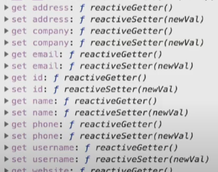
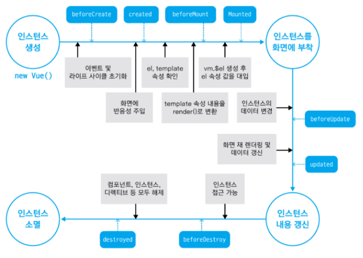

### Intro
- 오늘은 2019년 FEConf 때, 장기효님이 Vue.js 입문자가 실무에서 주의해야 할 5가지 특징 강의를 들었습니다.
- 이를 바탕으로 5가지 특징을 정리해보았습니다.

<br>

<br>

#### 1. 반응성에 대해 알아야 할 점

- 반응성은 언제 설정될까?

  - 인스턴스가 생성될 때 data의 속성들을 초기화

- **생성하는 시점에 없었던** data는 반응하지 않습니다.

  - ```vue
    <script>
    var vm = new Vue({
    	data: {
            user: {
                name: 'Captain'
            }
       }
    })
    vm.user.age += 1; // age 값이 변하더라도 화면은 갱신되지 않는다
    </script>
    
    ```

<br>

##### 반응성을 이해하지 못했을 때의 실수

###### 화면에서만 필요한 UI 상태 값을 다룰 때 (토글, 체크박스)

- ```html
  <html lang="en">
    <head>
      <meta charset="UTF-8" />
      <meta name="viewport" content="width=device-width, initial-scale=1.0" />
      <meta http-equiv="X-UA-Compatible" content="ie=edge" />
      <title>Reactivity Caveat 1</title>
      <style>
        li {
          list-style: none;
        }
      </style>
    </head>
    <body>
      <div id="app">
        <ul>
          <li v-for="user in users">
            <input
              type="checkbox"
              :name="user.name"
              :id="user.id"
              :checked="user.checked"
              @change="user.checked = !user.checked"
            />
            <span>{{ user.name }}</span>
          </li>
        </ul>
        <button @click="checkFirstUser">check the first check-box</button>
        <button @click="uncheckFirstUser">uncheck the first check-box</button>
      </div>
  
      <script src="https://cdn.jsdelivr.net/npm/vue/dist/vue.js"></script>
      <script>
        new Vue({
          el: '#app',
          data: {
            users: [],
          },
          created() {
            this.fetchUsers();
          },
          methods: {
            fetchUsers() {
              fetch('https://jsonplaceholder.typicode.com/users')
                .then(response => response.json())
                .then(data => {
                  this.users = data;
                })
                .catch(error => console.log(error));
            },
            checkFirstUser() {
              this.users[0].checked = true;
              console.log('check state : ', this.users[0].checked);
            },
            uncheckFirstUser() {
              this.users[0].checked = false;
              console.log('check state : ', this.users[0].checked);
            },
          },
        });
      </script>
    </body>
  </html>
  ```

  - 체크를 했음에도 false라고 뜨고, 체크를 하지 않았음에도 true라고 뜹니다.

- 해결 방법

  - ```html
    <html lang="en">
      <head>
        <meta charset="UTF-8" />
        <meta name="viewport" content="width=device-width, initial-scale=1.0" />
        <meta http-equiv="X-UA-Compatible" content="ie=edge" />
        <title>Reactivity Caveat 1</title>
        <style>
          li {
            list-style: none;
          }
        </style>
      </head>
      <body>
        <div id="app">
          <ul>
            <li v-for="user in users">
              <input
                type="checkbox"
                :name="user.name"
                :id="user.id"
                :checked="user.checked"
                @change="user.checked = !user.checked"
              />
              <span>{{ user.name }}</span>
            </li>
          </ul>
          <button @click="checkFirstUser">check the first check-box</button>
          <button @click="uncheckFirstUser">uncheck the first check-box</button>
        </div>
    
        <script src="https://cdn.jsdelivr.net/npm/vue/dist/vue.js"></script>
        <script>
          new Vue({
            el: '#app',
            data: {
              users: [],
            },
            created() {
              this.fetchUsers();
            },
            methods: {
              fetchUsers() {
                fetch('https://jsonplaceholder.typicode.com/users')
                  .then(response => response.json())
                  .then(data => {
                    this.users = data;
                    this.$set(this.users[0], 'checked', false)
                  })
                  .catch(error => console.log(error));
              },
              checkFirstUser() {
                this.users[0].checked = true;
                console.log('check state : ', this.users[0].checked);
              },
              uncheckFirstUser() {
                this.users[0].checked = false;
                console.log('check state : ', this.users[0].checked);
              },
            },
          });
        </script>
      </body>
    </html>
    ```

<br>

###### 백엔드에서 불러온 데이터에 임의 값을 추가하여 사용하는 경우

- ```vue
  <html lang="en">
    <head>
      <meta charset="UTF-8" />
      <meta name="viewport" content="width=device-width, initial-scale=1.0" />
      <meta http-equiv="X-UA-Compatible" content="ie=edge" />
      <title>Reactivity Caveat 1</title>
    </head>
    <body>
      <div id="app">
        <div>
          <h1>User Info</h1>
          <p>Name : {{ user.name }}</p>
          <p>Email : {{ user.email }}</p>
          <p>Region : {{ user.region }}</p>
          <button @click="changeName">change Name</button>
          <button @click="changeRegion">change Region</button>
          <button @click="addReactivityToRegion">add Reactivity To Region</button>
        </div>
        <div>
          <h1>User Data</h1>
          <div>
            {{ user }}
          </div>
          <h1>User Region</h1>
          <div v-if="user.region">
            {{ user.region }}
          </div>
        </div>
      </div>
  
      <script src="https://cdn.jsdelivr.net/npm/vue/dist/vue.js"></script>
      <script>
        new Vue({
          el: '#app',
          data: {
            user: {},
          },
          created() {
            this.fetchUsers();
          },
          methods: {
            fetchUsers() {
              fetch('https://jsonplaceholder.typicode.com/users/1')
                .then(response => response.json())
                .then(data => {
                  this.user = data;
                })
                .catch(error => console.log(error));
            },
            changeName() {
              this.user.name = 'Josh';
            },
            changeRegion() {
              this.user.region = 'Seoul';
              console.log('The region has been changed', this.user);
            },
            addReactivityToRegion() {
              this.$set(this.user, 'region', 'To Be Decided');
              console.log(this.user);
            },
          },
        });
      </script>
    </body>
  ```

  - id값이 임의로 들어가 있습니다.
  - reactivity가 주입됐는지는 get과 set을 확인합니다.
    - 

<br>

###### 뷰엑스의 state도 data와 동일하게 취급

- ```
  state: {
  	user: {name: 'Captain'}
  },
  mutations: {
  	// 생성하는 시점에 없었던 데이터는 반응성이 없음
  	setUserAge: function(state) {
  		state.user.age = 23
  	},
  	//객체 속성을 임의로 추가 또는 삭제하는 경우 뷰에서 감지 못함
  	deleteName: function(state) {
  		delete state.user.name
  	}
  }
  ```

  

- 그러나 뷰3.0에서는 괜찮습니다! 

  > Object.defineProperty()에서 Proxy기반으로 변화합니다.

  - ```
    var obj = {};
    
    //Vue 2.x
    Object.defineProperty(obj, 'str', {..})
    
    //Vue 3.x
    new Proxy(obj, {..})
    ```

<br>

<br>

#### 2. DOM 조작

> 오래된 습관 버리기

##### (기존) 화면 조작을 위한 DOM 요소 제어 방법

- 특정 **DOM을 검색**해서 제어하는 방법

  - ```
    // 네이티브 JS
    documment.querySelector('#app')
    
    // 제이쿼리 라이브러리
    $('#app')
    ```

<br>

##### (**기존방식**)사용자의 입력 이벤트를 기반으로 한 DOM 요소 제어

- ```
  // 버튼 요소 검색
  var btn = document.querySelector('#btn');
  
  // 사용자의 클릭 이벤트를 기반으로 가장 가까운 태그 요소를 찾아 제거
  btn.addEventListener('click', function(event) {
  	event.target.closest('.tag1').remove();
  })
  ```

<br>

##### (Vue.js 방식)사용자의 입력 이벤트를 기반으로 한 DOM 요소 제어

> Vue에서 제공하는 **ref속성**을 이용합니다.

- ```
  <!-- HTML 태그에 ref 속성 추가 -->
  <div ref="hello"> Hello Ref </div>
  
  
  //인스턴스에서 접근 가능한 ref 속성
  this.$refs.hello; //div 엘리먼트 정보
  ```

<br>

##### (Vue.js 방식) 디렉티브를 활용한 DOM 요소 제어

> Vue 디렉티브 에서 제공되는 정보를 최대한 활용

- ```vue.js
  <ul>
  	<li v-for="(item, index) in items">
  		<span v-bind:id="index">{{ item }}</span>
  	</li>
  </ul>
  ```

<br>

##### Dom 제어 사고 전환이 필요한 실제 사례자

- ```
  <ul>
  	<li v-for="(item, index) in items">
  		<span v-bind:id="index">{{ item }}</span>
  	</li>
  </ul>
  ```

- ```vue
    
  <html lang="en">
    <head>
      <meta charset="UTF-8" />
      <meta name="viewport" content="width=device-width, initial-scale=1.0" />
      <meta http-equiv="X-UA-Compatible" content="ie=edge" />
      <title>DOM Handling</title>
      <style>
        li {
          padding: 0.6rem;
        }
        .hide {
          display: none;
        }
      </style>
    </head>
    <body>
      <div id="app">
        <ul>
          <li @click="removeItem">
            <span>메뉴 1</span>
            <div class="child hide">
              메뉴 설명
            </div>
          </li>
          <li @click="removeItem">
            <span>메뉴 2</span>
            <div class="child hide">
              메뉴 설명
            </div>
          </li>
          <li @click="removeItem">
            <span>메뉴 3</span>
            <div class="child hide">
              메뉴 설명
            </div>
          </li>
        </ul>
      </div>
  
      <script src="https://cdn.jsdelivr.net/npm/vue/dist/vue.js"></script>
      <script>
        new Vue({
          el: '#app',
          data: {
            items: ['메뉴 1', '메뉴 2', '메뉴 3'],
          },
          methods: {
            removeItem(event) {
              event.target.lastChild.classList.toggle('hide');
            },
          },
        });
      </script>
    </body>
  </html>
  ```

  - removeItem을 보면 클릭한 이벤트의 위치를 기준으로 마지막 child를 쫓아가서 토글하고 있었음. 

  - 이를 개선하는 방법은? 

    - ```html
        
      <html lang="en">
        <head>
          <meta charset="UTF-8" />
          <meta name="viewport" content="width=device-width, initial-scale=1.0" />
          <meta http-equiv="X-UA-Compatible" content="ie=edge" />
          <title>DOM Handling</title>
          <style>
            li {
              padding: 0.6rem;
            }
            .hide {
              display: none;
            }
          </style>
        </head>
        <body>
          <div id="app">
            <ul>
            	<li v-for="(item, index) in items" @click="removeItem(index)">
            		<span>{{ item }}</span>
            		<div class="child hide" ref="listItem">
            			메뉴 설명
            		</div>
            	</li>
            </ul>
          </div>
      
          <script src="https://cdn.jsdelivr.net/npm/vue/dist/vue.js"></script>
          <script>
            new Vue({
              el: '#app',
              data: {
                items: ['메뉴 1', '메뉴 2', '메뉴 3'],
              },
              methods: {
                removeItem(index) {
                  this.$refs.listItem[index].classList.toggle('hide')
                },
              },
            });
          </script>
        </body>
      </html>
      ```

      - **re**f를 달아서 listItem에서 클래스리스트를 토글링 가능하다.
      - V-for은 index 지원이 가능하다.

<br>

<br>

#### 3. 인스턴스 라이프 사이클

- 인스턴스 라이프 사이클이란?
  - 뷰 인스턴스가 생성되고 소멸되기까지의 생애 주기
  - 

<br>


##### Vue 템플릿 속성

> 인스턴스, 컴포넌트의 표현부를 정의하는 속성

- ```
  // 인스턴스 옵션 속성
  new Vue({
  	data: { str: 'Hello World'},
  	template: '<div>{{ str }}</div>'
  })
  
  <!--싱글파일 컴포넌트 -->
  <template>
  	<div>{{ str }} </div>
  </template>
  ```

<br>

###### 뷰 템플릿 속성의 정체

> 실제 DOM 엘리먼트가 아니라 **Virtual DOM (자바스크립트 객체)**

- ```
  <!--사용자가 작성한 코드 -->
  <template>
  	<div>{{ str }} </div>
  </template>
  
  // 라이브러리 내부적으로 변환한 모습
  function render() {
  	with(this) {
  		return _c('div', [_v(_s(str))])
  	}
  }
  ```

<br>

<br>

###### 템플릿 속성이 실제로 유효한 시점

> 인스턴스가 화면에 **부착** (mounted)되고 난 후


1. 인스턴스 부착 시점을 이해하지 못한 사례 1

   ```vue.js
   <!DOCTYPE html>
     <body>
       <div id="app">
         <canvas id="myChart"></canvas>
       </div>
       <script>
         new Vue({
           el: '#app',
           created() {
             var ctx = document.querySelector('#myChart'); // null
             var myChart = new Chart(ctx, barChartOptions);
           },
         });
       </script>
     </body>
   </html>
   ```

   - mounted시점에서 querySelector를 이용하면 null이된다.

2. 인스턴스 부착 시점을 이해하지 못한 사례 2

- ```html
  <!DOCTYPE html>
    <body>
      <div id="app">
        <canvas id="myChart"></canvas>
      </div>
      <script>
        new Vue({
          el: '#app',
          created() {
          	this.$nextTick(function() { // 업데이트 시점 혼란 야기 및 코드 복잡도 증가
          		var ctx = document.querySelector('#myChart'); // null
           		var myChart = new Chart(ctx, barChartOptions);
          	})
          },
        });
      </script>
    </body>
  </html>
  ```

3. 인스턴스 부착 시점을 이해한 코드

- ```html
  <!DOCTYPE html>
    <body>
      <div id="app">
        <canvas id="myChart"></canvas>
      </div>
      <script>
        new Vue({
          el: '#app',
         	mounted() {
              var ctx = document.querySelector('#myChart'); // null
              var myChart = new Chart(ctx, barChartOptions);
          },
        });
      </script>
    </body>
  </html>
  ```

<br>

<br>

#### 4. ref속성

- 특정 DOM 엘리먼트나 하위 컴포넌트를 가리키기 위해 사용
- DOM 엘리먼트에 사용하는 경우 DOM 정보를 접근
- 하위 컴포넌트에 지정하는 경우 컴포넌트 인스턴스 정보 접근
- v-for 디렉티브에 사용하는 경우 Array 형태로 정보 제공
- **특정 DOM 요소를 조작하고 싶을 때 사용하는 속성**

<br>

##### ref 속성을 사용할 때 주의할 점

- ref속성은 템플릿 코드를 render 함수로 변환하고 나서 생성

- 접근할 수 있는 최초의 시점은 **mounted** 라이프사이클 훅

- ```
  <p ref="pTag">Hello</p>
  
  created: function() {
  	this.$refs.pTag; //undefined
  },
  mounted: function() {
  	this.$refs.pTag; //<p>Hello</p>
  }
  
  ```

<br>

##### ref 속성 사용할 때 주의할 점 2

- v-if 디렉티브와 사용하는 경우 화면에 해당 영역이 그려지기 전까진 DOM 요소 접근 불가

- ```
  <div v-if="isUser">
  	<p ref="w3c">W3C</p>
  </div>
  new Vue({
  	data: { isUser: false },
  	mounted: function() {
  		this.$refs.w3c //undefined
  	}
  })
  ```

- ```
  <div v-if="isUser">
  	<p ref="w3c">W3C</p>
  </div>
  new Vue({
  	data: { isUser: true },
  	mounted: function() {
  		this.$refs.w3c //<p>W3C</p>
  	}
  })
  ```

<br>

##### ref 속성 사용할 때 주의할 점 3

> 하위 컴포넌트의 내용을 접근할 순 있지만 남용하면 안된다.

- ```
  <div id="app">
  	<TodoList ref="list"></TodoList>
  </div>
  
  new Vue({
  	el: '#app',
  	methods: { //상위 컴포넌트에서 불필요하게 하위 컴포넌트를 제어하는 코드
  		fetchItems: function() { this.$refs.list.fetchTodos(); }
  	}
  })
  ```

- 하위 컴포넌트의 라이프 사이클 훅을 이용

  - ```
    <div id="app">
    	<TodoList></TodoList>
    </div>
    
    var TodoList = {
    	methods: {
    		fetchTodos: function() { .. }
    	},
    	created: function() { this.fetchTodos(); }
    }
    ```

<br>

<br>

#### 5. computed 속성

##### computed 속성이란?

- **간결**하고 **직관적인** 템플릿 표현식을 위해 뷰에서 제공하는 속성

- ```
  <p>{{ 'hello' + str + '!!' }}</p> <!-- 템플릿 표현식만 이용하는 경우 -->
  <p>{{ greetingStr }}</p> <!--computed 속성을 활용하는 경우 -->
  
  new Vue({
  	data: { str: 'world' },
  	computed: {
  		greetingStr: function() {
  			return 'hello' + this.str + '!!'
  		}
  	}
  })
  ```

<br>

##### computed 속성 활용처 1

> 조건에 따라 HTML 클래스를 추가, 변경할 때

- ```
  <li v-bind:class="{ disabled: isLastPage }"></li>
  
  computed: {
  	isLastPage: function() {
          var lastPageCondition = this.paginationInfo.current_page >= this.paginationInfo.last_page;
          var nothingFetched = Object.keys(this.paginationInfo).length === 0;
          return lastPageCondition || nothingFethced
  	}
  }
  ```

  - 클래스 속성이 많아지면 복잡해보인다.
  - 그렇기 때문에 computed를 통해 if로 조건식을 분기하면 깔끔해진다.

- 깔끔한 표현은?

  - ```
    <li v-bind:class="listItemClass"></li>
    
    computed: {
    	listItemClass: function() {
    	}
    }
    ```

<br>

##### computed 속성 활용처 2

> 스토어(Vuex)의 state 값을 접근할 떄

- ```
  <div>
  	<p>{{this.$store.state.module1.str}}</p>
  	<p>{{ module1Str }}</p>
  </div>
  
  computed: {
  	module1Str: function() {
  		return this.$store.state.module1.str
  	}
  }
  ```

<br>

##### computed 속성 활용처 3

> Vue i18n과 같은 다국어 라이브러리에도 활용 가능

- ```
  <div>
  	<p>{{ 'userPage.common.filter.input.label'}}</p>
  	<p>{{ inputLabel }}</p>
  </div>
  
  computed: {
  	inputLabel: function() {
  		return $t('userPage.common.filter.input.label')
  	}
  }
  ```